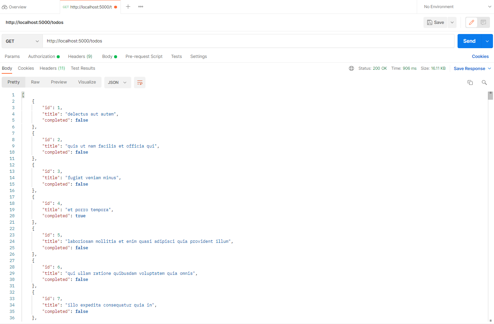
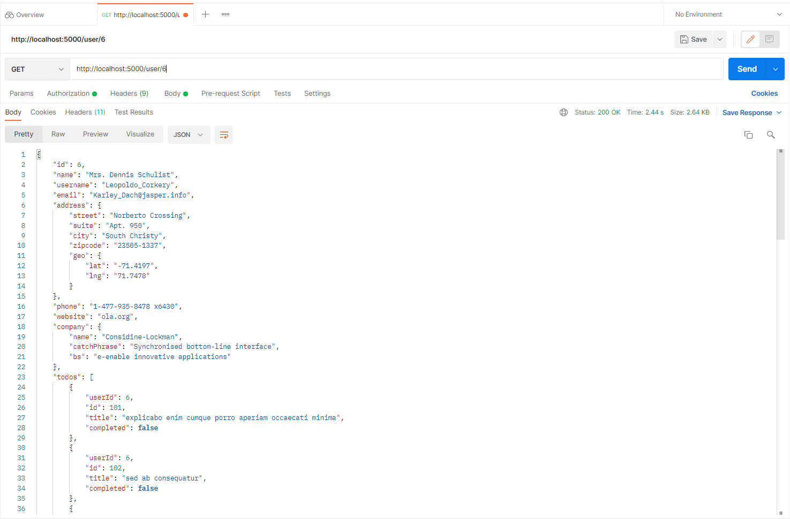
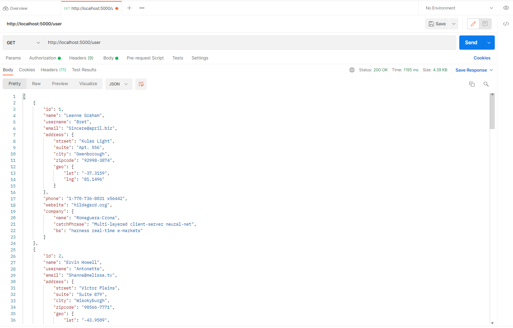
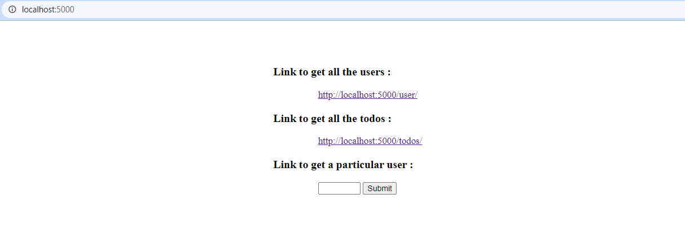

### How to install dependencies:
    - npm install
### How to start the application:
    - npm start
### Links:
   - Homepage : [http://localhost:5000/](http://localhost:5000/) 
   - GET /todos : [http://localhost:5000/todos](http://localhost:5000/todos)
   - GET /user/{userId} : [http://localhost:5000/user/{id}](http://localhost:5000/user/{id})
### Tasks to be completed
   * GET /todos     
        The API returns all the todo objects except userId field in it.                        
   
  
   * GET /user/pass-your-user-id            
        The output contains all the user information and its todos where userid field of todos matches with userid provided in URL.
   
   
   * GET /user  
        The output gives a list of all the users                            
   
      
   * Homepage
        This page has all the links for created apis and input field for getting the user information with id. 
   